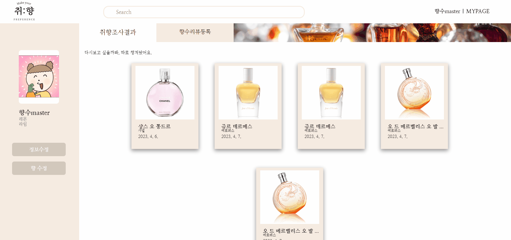

<h1>취:향 </h1>

<strong>"당신의 취향을 찾아드립니다"<strong>
  
<a href="https://makeyourpreference.com/" target="_blank"> -- 취향 홈페이지 바로가기 -- </a>

 

취향다 니향기에.. 🌹
---

## 📚 목차

1. [개요]

2. [팀]

3. [서비스 소개]

   1. [서비스 기획 목표]

   2. [팀]

   3. [ERD]

   4. [구현 기능]

---

## 🌟 개요

### 프로젝트 기간

2023.02.20 ~ 2023.04.07

### 기술 스택 👨‍💻

---

## 팀원

### 프론트엔드

- 김경아
- 조재형
- 허정범

### 백엔드

- 김경아
- 김민식
- 박윤지
- 최동호
- 허정범

---

## 📽️ 서비스 소개

### 서비스 기획

사용자는 취향 조사를 통해 자신의 취향과 선호향을 입력하면, 그에 맞는 향수 추천 목록을 제공받을 수 있습니다. 
또한, 사용자들의 리뷰와 평가를 통해 추천 향수에 대한 정보를 공유하고, 유저 개인에 맞는 향수 추천도 제공합니다.
이 서비스를 통해 사용자들은 쉽고 빠르게 자신에게 맞는 향수를 찾을 수 있습니다.

---

## SSAFY 8기 2학기 특화 프로젝트 - 취:향

   
## 배경

---

매년 수많은 향수 브랜드와 제품이 출시되면서, 소비자들은 어떤 제품을 선택해야 할지 많은 고민을 하고 있습니다. 이에 따라 인터넷 검색이나 온라인 쇼핑몰에서 제공하는 추천 기능 등을 활용하여 제품을 선택하는 경우가 많은데, 이러한 방식은 판매 사이트에서 판매중인 향수 위주로 추천을 해주며 소비자의 취향과 용도에 맞는 제품을 찾는 것이 어렵다는 단점이 있습니다. 이러한 문제점을 해결하기 위해, 향수 추천 사이트 서비스를 기획하게 되었습니다.

## 주요기능

---

### 취향 조사

**취향 조사를 통해 당신의 취향을 찾아드립니다.**

- 상황에 맞는 취향 조사를 통해 향수를 하나 추천합니다.
- 더 궁금할 시 로그인을 통해 더 많은 추천을 받을 수 있습니다.

### 향수 추천

**개개인 유저에 맞는 향수를 찾아드립니다.**

- 취향 조사에 나온 향과 비슷한 향수를 추천합니다.
- 유저가 등록한 향수를 기반으로 비슷한 사람들이 좋아하는 향수를 추천합니다.
- 유저가 선호하는 향을 기반으로 향수를 추천합니다.
- 유저가 등록한 향수들과 반대되는 향수를 추천합니다.
- 유저가 클릭한 향수들과 비슷한 향수를 추천합니다.
- 인기 있는 향수를 추천합니다.

### 리뷰

**유저의 취향을 알리고 추천을 받아보세요.**
- 유저가 선호하는 향수를 등록합니다.
- 향수와 어울리는 이미지를 등록하여 향수를 시각화합니다.

### ERD

### 구현 기능-

#### ✔️ 취:향 소개

  - 시작 전 취향에 대한 간단한 소개를 보여줍니다.

   
#### ✔️ 취:향 회원가입

  - 카카오 소셜 로그인으로 회원가입 할 수 있습니다.
  - 향수 추천을 위해 유저가 좋아하는 향, 싫어하는 향을 선택하는 과정이 포함되어있습니다.

   
#### ✔️ 취향 조사

  **당신의 취향을 찾아드립니다.**

  - 상황에 맞는 이미지를 선택해 유저의 취향을 찾아줍니다.

   
#### ✔️ 메인 페이지

  - 향수의 인기순위 및 유저의 연령별 인기순위를 보여줍니다.
  - 직전에 봤던 향수와 비슷한 향수를 보여줍니다.
   

#### ✔️ 가이드 페이지

   **향수를 처음사용하는 분들을 위해**
   
  - 향수를 잘 모르는 분들을 위해 향수에 대한 지식을 보여줍니다..
   
   
#### ✔️ 향수 추천

  **개개인 유저에 맞는 향수를 찾아드립니다.**
  
  - 유저 개개인에 맞는 향수를 보여줍니다.
  - 유저의 취향, 선호향, 리뷰가 변경시 새로운 추천을 보여줍니다.
   

#### ✔️ 향수 상세 조회

  - 향수 상세정보 및 리뷰를 보여줍니다.
  - 유저가 등록한 향수 이미지를 인기순위로 보여줍니다.
   

#### ✔️ 마이페이지

  **다시보고 싶을까봐, 따로 챙겨놨어요.**

  - 유저가 했던 취향 조사 결과를 보여줍니다.

  **가지고 있는 향수를 등록하고, 당신의 취향에 맞는향수를 추천받아요.**

  - 향수를 등록 하며, 등록된 리뷰를 보여줍니다.
   
   
#### ✔️ 향 수정

  - 유저가 등록했던 향을 수정할 수 있습니다.
   
---

## 📃 협업툴

#### Gitlab

- git-flow 방식 기반의 코드 버전 관리
- 이슈 발생 시 해당 기능 담당자 끼리 토론

#### JIRA

- 매주 목표량 달성을 위한 Sprint 진행

- 업무 할당량 별로 Story Point 설정 후 진행

#### 회의

- 매일 아침 프로젝트 진행 전에 30분정도의 스크럼
  회의를 통해, 전날 목표 달성량과 당일 해야 할 업무에 대한 브리핑

- 서로 소통을 할 부분이 있으면, 즉석으로 담당자끼리 회의 소통 진행

#### Notion

- 매일 스크럼 회의를 기록하는 회의록 작성

- 컨벤션 정리

  

## 프로젝트 산출물

---

- 로그인 시퀀스 다이어그램

---

## Api 명세서

---

## 기능 명세서

